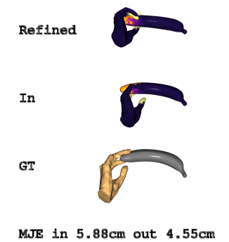

# ContactOpt: Optimizing Contact to Improve Grasps

[Patrick Grady](https://www.pgrady.net/), 
[Chengcheng Tang](https://scholar.google.com/citations?hl=en&user=WbG27wQAAAAJ),
[Christopher D. Twigg](https://scholar.google.com/citations?hl=en&user=aN-lQ0sAAAAJ),
[Minh Vo](https://minhpvo.github.io/),
[Samarth Brahmbhatt](https://samarth-robo.github.io/),
[Charles C. Kemp](http://charliekemp.com/)


Physical contact between hands and objects plays a critical role in human grasps. We show that optimizing the pose of a hand to achieve expected contact with an object can improve hand poses inferred via image-based methods. Given a hand mesh and an object mesh, a deep model trained on ground truth contact data infers desirable contact across the surfaces of the meshes. Then, ContactOpt efficiently optimizes the pose of the hand to achieve desirable contact using a differentiable contact model. Notably, our contact model encourages mesh interpenetration to approximate deformable soft tissue in the hand. In our evaluations, our methods resulted in grasps that better matched ground truth contact, had lower kinematic error, and were significantly preferred by human participants.

[[Paper]](https://www.pgrady.net/contactopt/ContactOpt.pdf) [[Paper website]](https://www.pgrady.net/contactopt/) [[Supplementary]](https://www.pgrady.net/contactopt/ContactOptSupp.pdf)

## Installation

Refer to [installation instructions](docs/INSTALL.md).

## Run ContactOpt on the demo

A small dataset of 10 grasps from an image-based pose estimator has been included (paper, section 4.2.2). To run ContactOpt on this demo dataset:
```
python contactopt/run_contactopt.py --split=demo
``` 

To calculate aggregate statistics: 
```
python contactopt/run_eval.py --split=demo
``` 

To visualize the individual results, run the evaluation script with the `--vis` flag. Pan/rotation/zoom are controlled with the mouse, and press `Q` to advance to the next frame.
```
python contactopt/run_eval.py --split=demo --vis
```


## Run ContactOpt on user-provided data

A demo script has been provided to demonstrate running ContactOpt on a single hand/object pair. This file may be easily modified to run on your own data. Demo files containing the object mesh and mano parameters have been provided. 

```
python contactopt/run_user_demo.py 
python contactopt/run_eval.py --split=user --vis
```

Note that this project uses the MANO pose parameterized with 15 PCA components. Other projects may use the MANO model with different formats (such as 45 individual joint angles). The `contactopt.util.fit_pca_to_axang` function has been provided to convert between these modalities.

## Running on Datasets

To run ContactOpt on the datasets described in the paper, download and generate the dataset as described in the [installation document](docs/INSTALL.md). Use the `--split=aug` flag for Perturbed ContactPose, or `--split==im` for the image-based pose estimates.

```
python contactopt/run_contactopt.py --split=aug
python contactopt/run_eval.py --split=aug
``` 

## Training DeepContact

The DeepContact network is trained on the Perturbed ContactPose dataset.
```
python contactopt/train_deepcontact.py
```

## Citation
```
@inproceedings{grady2021contactopt,
    author={Grady, Patrick and Tang, Chengcheng and Twigg, Christopher D. and Vo, Minh and Brahmbhatt, Samarth and Kemp, Charles C.},
    title = {{ContactOpt}: Optimizing Contact to Improve Grasps},
    booktitle = {Conference on Computer Vision and Pattern Recognition (CVPR)},
    year = {2021}
}
```

## License

The code for this project is released under the [MIT License](LICENSE).